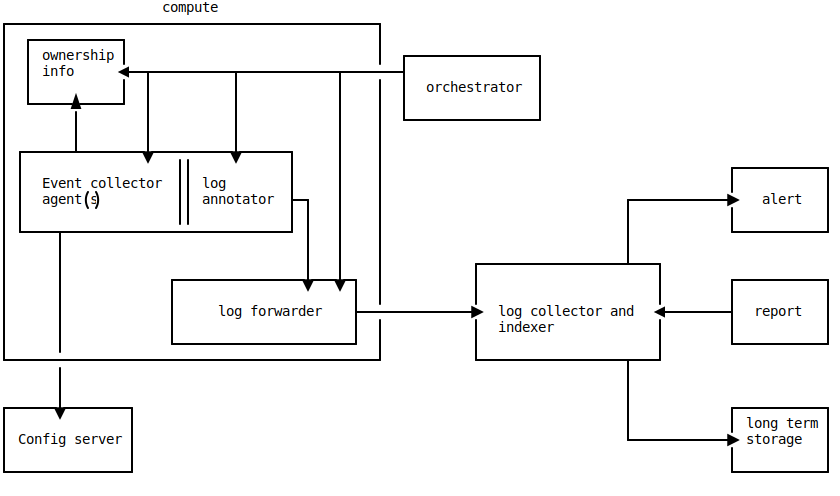

# Introduction to the Audit Framework

## Table of contents
1. [The problem statement](#the-problem-statement)
2. [Available Solutions](#available-solutions)
3. [An overview of the components and their
   interactions](#an-overview-of-the-components-and-their-interactions)

## The problem statement
There are too many tools for collecting data from an endpoint, particularly
application servers, from a security standpoint. The main reason any data is
collected from an endpoint apart from performance metrics is to identify any
malicious activity or to produce continuous compliance proofs using audit logs
proving appropriate security measures were in place all the time.

The collected data may be classified into two classes. Static and dynamic.
Anything that is not affected by regular application operation can be considered
static information.

Some relevant static data that may be collected are as follows:
* Hardware versions
* OS and patch version
* Kernel modules loaded
* Packages installed
* Drives mounted
* Users and groups
* Network and time configuration
* System cryptographic trust
* Ownership information
* Crontab entries and many more

Some relevant dynamic data that may be collected are as follows:
* Running processes
* Network IO
* PAM related user activity
* Sensitive file modification and accesses
* Login and SSH activity
* Syscall activity

All of this data is required to determine the security posture of an endpoint
and any unauthorized or malicious activity. This is more aligned with linux
servers as those seem to be the dominant kind in the server space. But this is
in no way limited to servers, all of this can be extended to other platforms.

In order to fully utilize all of this information including correlation or
filtering as soon as possible, there needs to be an efficient and streamlined
machinery which allows for event generation with higher accuracy and low
overhead transport of those events.

For a security audit framework,
1. Every event should have sufficient information to track it to origin and
   owner.
2. Events should be visible to everyone for getting insights and creating
   self-sufficient audit reports.
3. The configuration installed should be flexible enough to have bundles from
   different sources. Example, audit requirements are understood by security
   teams and application specific configuration is understood by the application
   team.
4. The configuration should be open and tamper resistant.
5. The trust model should be a generic one to allow cross compatibility.
6. The complexity of the infrastructure required should be opt-in.

## Available solutions

There are a plethora of tools that can be used to collect the above data. For
example,
* [auditd](https://github.com/linux-audit/audit-userspace)
* [chef](https://github.com/chef/chef)
* [osquery](https://github.com/osquery/osquery)
* [kolide](https://github.com/kolide)
* [sysdig](https://sysdig.com/)
* [puppet](https://puppet.com/)
* [elastic/auditbeat](https://www.elastic.co/beats/auditbeat)
* [slackhq/go-audit](https://github.com/slackhq/go-audit/)

These are just tools that are used to collect logs and are not exhaustive and/or
compatible with each other. Out of the bunch, osquery seems to be the most
versatile due to its feature set and extensibility.

There is no standardization on how the data is collected and transported which
makes it difficult to integrate all the data in a single place in order to
correlate and pull data from a single coherent source.

## An overview of the components and their interactions.

First, we shall define the pipeline that needs to be established in order to get
the data flowing and then next sections will have details on what each component
shall be responsible for.

### An illustration of the components

_Made with [asciiflow](https://asciiflow.com/) and
[ivanceras/svgbob](https://github.com/ivanceras/svgbob)_

### Event collector agent(s)

The core of the solution is an event collector (could be more than one) and a
data normalizer since we need a consistent format of output which can have
custom fields (since there needs to be a consistent filtering possible).

The agent or multiple agents would read their configuration from a source that
is local, remote or a combination of both. The agents emit the required events
to a destination.

### Agent Configuration

The agent configuration is published by a controlling team (usually the team who
is responsible for providing infrastructure for teams to fulfil their audit
and compliance requirements). The published configuration would then be consumed
by the event collector agent(s). The verification of the configuration must be
taken care by either the orchestrator or the agent itself.

### Log annotation and transport

The event may be picked up by an annotator which annotates every event with
relevant tracking information for observability. Once the event is annotated, it
can then be sent to a hot data collector, i.e. a data collector which can keep
the events ready for query for a certain period of time.

### Log collector

The events, once collected in a single (could be distributed, but should share a
context in terms of compliance scope or any other boundary, for example region,
cloud, organizations, teams etc.). These log collectors should then have a
mechanism to query the data for reporting and alerting.

### Alerting and notification channels

Once the data is in the log collectors, callbacks or periodic queries can be set
to fire alerts based on parameters. Those alerts can be sent to owners extracted
from the events via Instant messaging, email or Slack. Depending on the kind of
data, it can be compared with vulnDB and evaluated against known vulnerabilities
and published as dashboards. It can also be used as a snapshot of the state of
a compute for compliance standards and benchmarks.

